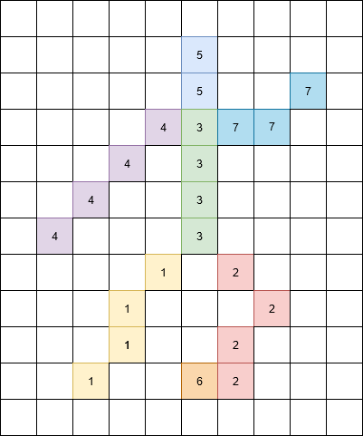
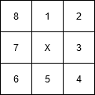
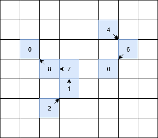

###########
Model input
###########

This page describes all possible modelinput. 

CN-WS accepts input files and **a lot** of parameters. All these inputs are
described below.

Folders
=======

input directory
***************

Path to the directory where all inputfiles can be found. If the path does not
exist, an exception is raised and the model run will stop.

output directory
****************

Path to the directory where all model output will be written. If the directory
does not exist, it is created by the model.

Files
=====

All input rasters must be
`Idrisi-rasters <https://gdal.org/drivers/raster/Idrisi.html>`_ and must have
the same amount of columns, rows and cellsize.
If one of the  input rasters has a different spatial extent, the model will
raise an exception and will stop the execution.

Idrisi-rasters are the native file format of Idrisi gis, but can be opened,
edited and saved with almost every GIS-package like QGIS or SAGA-GIS,
thanks to the `GDAL library <https://gdal.org>`. 

DTM filename
************

Filename of the raster with a digital terrain model (DTM). This raster contains
at least for every pixel inside the model domain or catchment an elevation value
in meters.
The idirisi raster must be formatted as float32.

.. note::
	CN-WS does not take nodata values (e.g. -9999) into account. When a nodata
	value in the dtm raster is encountered, it is considered as an elevation.
	Consequently, slopes are calculated wrong. Thus, the user must ensure all
	pixels in the model domain have an elevation value, and that at least two
	pixels outside the model domain have a valid elevation value.

.. _prcmap:

Parcel filename
***************

Filename of the Parcel or Landuse map. CN-WS requires information about landuse
and parcel boundaries in the routing algorithm, but also when distributing the
sediment through the model domain. Every pixel in the model domain must contain
a landuse value. Every value > 0 indicates a unique agricultural field. So, all
pixels of an agricultural field have the same value et pixels belonging to a
different parcel have different value.
The definition of these unique parcel values are important to define the routing
within a parcel.

+----------------------+-----------+
|Landuse class         | pixel id  | 
+======================+===========+
| agricultural fiels   | > 0       | 
+----------------------+-----------+
| outside model domain |  0        | 
+----------------------+-----------+
| river                | -1        | 
+----------------------+-----------+
| infrastructure       | -2        | 
+----------------------+-----------+
| forest               | -3        | 
+----------------------+-----------+
| pasture              | -4        | 
+----------------------+-----------+
| open water           | -5        | 
+----------------------+-----------+
| grass strips         | -6        |
+----------------------+-----------+

The datatype of this raster is integer 16.

.. note::
	The Parcel raster can contain only values between -32757 and 32757.
	Therefore, only 32757 unique agricultural field id's can be used in the
	parcel map. When more parcel id's are necessary (e.g. in very large
	catchments), you can give two or more agricultural fields the same id.
	Theoretically, the model will consider these two parcels as a single parcel.
	In practice, these two parcels will never be treated as one because they are
	probably situated in another part of the catchment.

Sewer map filename
******************

Filename of the sewer map. This raster is only mandatory when
:ref:`Include sewers = 1 <inlcudesewers>`.

All pixels in the sewer map contain values between 0 and 1. The value represents
the fraction of the outgoing sediment in this pixel that is entering the sewer
system.

The datatype of the sewer map is float32.

.. _tildirmap:

Tillage direction filename
**************************

Filename of a raster with the tillage direction in degrees to the North.

The datatype of the tillage direction raster is float32.

.. _orientedroughnessmap:

Oriented roughness filename
***************************

Filename of a raster with the oriented roughness. The oriented roughness is the
height of the microrelief (in cm) due to ploughing.

The datatype of the oriented roughness raster is float32.

.. _buffermap:

Buffer map filename
*******************

Filename of the buffer map. This raster is only mandatory when
:ref:`Include buffers = 1 <includebuffers>`.

The figure shows an example of a buffermap with three buffer basins. The outlet
of every buffer is marked with the buffer id (1, 2 and 3 in this example). The
other pixels belonging to the buffer get the
:ref:`extension id <bufferdata>`. All other pixels in the raster are set to
zero.

.. figure:: _static/png/buffermap.png
	:scale: 80%

The datatype of the buffermap is integer16.

.. _ditchmap:

Ditch map filename
******************

Filename of the ditch map. This raster is only mandatory when
:ref:`Include ditches = 1 <includeditches>`. See :ref:`here <routingmap>` for
more information on how to create this map.

.. _dammap:

Dam map filename
****************

Filename of the dam map. This raster is only mandatory when
:ref:`Include dams = 1 <includedams>` See :ref:`here <routingmap>` for more
information on how to create this map.

P factor map filename
*********************

Filename of the :ref:`P-factor <pfactor>` map. 

TO DO: dataype raster

.. _riversegmentfile:

River segment filename
**********************

Filename of the river segment map. This raster is only mandatory when
:ref:`Output per river segment = 1 <outputsegment>`.

A river segment is a part of the river (usualy a part between two confluences
with other rivers). To give detailed information about the sediment
entering every river segment, a river segment map must be created. 

The river segment map is raster where every river pixel (every pixel with value
-1 in the :ref:`parcel map <prcmap>`) gets the id of the segment where it
belongs too. Every segment has a unique (integer) id.

In the figure below, an example of a river segment map with seven segments is
given. All pixels which are no river pixels get value 0.

The datatype of the river segment map is integer16. The segments id's in the
context of Flanders are defined by the VHA (see also note
:ref:`here <outputsegment>`).

.. _adjsegments:

adjectant segments
******************

Table with adjectant  river segments. This table is only mandatory when
:ref:`River routing = 1 <riverrouting>`. The table consists out of two columns:
from and to. Every row indicates a connection between two segments:
segment *from* flows into segment *to*. The values in the table represent the
segment-ids of the :ref:`river segment map <riversegmentfile>`.

Based on the example :ref:`river segment map <riversegmentfile>`, an example
table with adjectant river segments is displayed below:

+-----+---+
|from |to |
+=====+===+
|1    |3  |
+-----+---+
|2    |3  |
+-----+---+
|3    |5  |
+-----+---+
|4    |5  |
+-----+---+
|6    |2  |
+-----+---+
|7    |5  |
+-----+---+

.. _upstrsegments:

upstream segments
*****************

Table with upstream segments. This table is only mandatory when
:ref:`River routing = 1 <riverrouting>`. In the table three columns are present:

- edge (integer): segment id
- upstream edge (integer): segment id of one of the upstream segments of *edge*
- proportion (float, between 0 and 1): the fraction of the upstream segment that
  flows into the considered downstream segment. If the fraction is < 1, the
  upstream segment flows into two downstream segments.

Based on the example :ref:`river segment map <riversegmentfile>`, an example
table with adjectant upstream segments is displayed below:

+-----+--------------+-----------+
|edge |upstream edge |proportion |
+=====+==============+===========+
|3    |1             |1.0        |
+-----+--------------+-----------+
|3    |2             |1.0        |
+-----+--------------+-----------+
|5    |4             |1.0        |
+-----+--------------+-----------+
|5    |3             |1.0        |
+-----+--------------+-----------+
|5    |2             |1.0        |
+-----+--------------+-----------+
|5    |1             |1.0        |
+-----+--------------+-----------+
|5    |6             |1.0        |
+-----+--------------+-----------+
|5    |7             |1.0        |
+-----+--------------+-----------+
|6    |2             |1.0        |
+-----+--------------+-----------+
|5    |1             |1.0        |
+-----+--------------+-----------+

.. _riverroutingmap:

river routing filename
**********************

Filename of the river routing map. This raster is only mandatory when
:ref:`River routing = 1 <riverrouting>`. See :ref:`here <routingmap>` for more
information on how to create this map.

.. _routingmap:

routing map
***********

CN-WS accepts rasters where a single-flow routing along a line element in the
landscape is imposed by the user. The
:ref:`river routing map <riverroutingmap>`, :ref:`ditchmap <ditchmap>` and
:ref:`dam map <dammap>` are made according to the principles described here.

A routing map contains integer values between 0 and 8. Every value indicates a
direction the routing will follow. A pixel set to zero has no imposed routing.

Consider pixel X in the figure below. If the routing must flow from X to the
upper cardinal cell, pixel X will get value 1 in the routing map. If the routing
must flow from X to the lower left pixel, X will get value 6. All other
directions are set in the same way, according to the numbers in the figure.

An example of a routing map with two imposed routings is given here:

The datatype of a routing raster is integer16.

CN map filename
***************

Filename of the CN map. This raster is only mandatory when
:ref:`simple = 0 <simple>`.

This raster contains a CN-value for every pixel in the model domain. 

TO DO: datatype map?

.. _outletmap:

Outlet map filename
*******************

Filename of the outlet map. This raster is only mandatory when
:ref:`Manual outlet selection = 1 <manualoutlet>`.

Every outletpixel needs a unique id. These integer id's are stored in the outlet
map. All other pixels are zero.

The datatype of the outlet map is integer16.

.. _ktilmap:

ktil map filename
*****************

Filename of the ktil map. The ktil map contains values for ktil, the transport
capacity coefficient for tillage erosion.
This raster is only mandatory when :ref:`Create ktil map = 0 <createktil>`.

TO DO: dataype map?

.. _rainfallfile:

Rainfall filename
*****************

Filename of a textfile with rainfall values. The text file contains a table
(tab-delimeted) with two columns without header. The first column contains the
time in minutes (starting from 0), the second column contains the rainfall in mm.

The rainfall file is only mandatory when :ref:`Use R = 0 <useR>`.

K factor filename
*****************

Filename of the :ref:`K-factor <kfactor>` map. The soil erosivity factor or
K-factor of the RUSLE-equation for every pixel in the modeldomain is stored in
the K-factor map (kg.h/MJ.mm).

.. _cmap:

C factor map filename
*********************

Filename of the :ref:`C-factor <cfactor>` map. This raster contains values
between 0 and 1 and represent the dimensionless C-factor in the RUSLE equation.
Pixels outside the modeldomain are set to zero.

The dataype of the outlet map is float32.

.. _ktcmap:

ktc map filename
****************

Filename of the ktc map, a raster with transport capacity coeficients. This
raster is only mandatory when :ref:`Create ktc map = 0 <createktc>`.

The dataype of the ktc map is float32.

Variables
=========

Sewer exit
**********

integer

.. _claycontent:

Clay content parent material
****************************

The average fraction of clay in the soil in the modelled catchment in
percentages (float, between 0 and 1).

5 day antecedent rainfall
*************************

The total rainfall (in mm) during 5 days before the start of the rainfall event. 
The antecedent rainfall (float) is only mandatory when :ref:`Use R = 0 <useR>`

stream velocity
***************

float, mandatory when :ref:`simple = 0 <simple>`

alpha
*****

Alpha (float) is a calibration parameter of the CN-model. It determines the relation
between runoff and rainfall intensity. The parameter is only mandatory when
:ref:`simple = 0 <simple>`

beta
****

Beta (float) is a calibration parameter of the CN-model. It determines the
relation between runoff and antecedent rainfall. The parameter is only mandatory
when :ref:`simple = 0 <simple>`

bulk density
************

The average bulk density (in kg/m³) of the soil in the catchment (integer). This
value is used to convert the mass of transported sediment to volumes. A good
default value for Belgium is 1350 kg/m³.

.. _rfactor_var:

R factor
********

The :ref:`R-factor <rfactor>` or rainfall erosivity factor in the RUSLE equation
(float, in MJ.mm/ha.h.year). This value is only mandatory when
:ref:`Use R = 0 <useR>`.

.. note::
	the user must make sure that the R and C-factor are calculated for the same
	time span (year, month, week,...).

LS correction
*************

float (default 1)

Number of buffers
*****************

The amount of buffers present in the :ref:`buffer map <buffermap>` is given in
this parameter (integer). The parameter is only mandatory when
:ref:`Include buffers = 1 <includebuffers>`.

Number of forced routing
************************

int

.. _ktclow:

ktc low
*******

ktc low is the transport capacity coefficient (float) for pixels with a low
erosion potential. The parameter is only mandatory when
:ref:`Create ktc map = 1 <createktc>`.

.. _ktchigh:

ktc high
********

ktc high is the transport capacity coefficient (float) for pixels with a high
erosion potential. The parameter is only mandatory when
:ref:`Create ktc map = 1 <createktc>`.

.. _ktclimit:

ktc limit
*********

ktc limit is a threshold value (float). Pixels with a C-factor higher as
ktc limit will get :ref:`ktc high <ktchigh>` in the ktc map,
pixels with a C-factor below ktc limit, will get :ref:`ktc low <ktclow>` in the
ktc map. This parameter is only mandatory when
:ref:`Create ktc map = 0 <createktc>` or :ref:`Calibrate = 1 <Calibrate>`

.. _ktildefault:

ktil default
************

The transport capacity coefficient for tillage erosion on agricultural fields. 
The integer value is expressed in kg/m/year. A recomended default value is
600 kg/m/year.

This parameter is only mandatory when :ref:`Create ktil map = 1 <createktil>`

.. _ktilthres:

ktil threshold
***************

ktil threshold is a float between 0 and 1. Pixels with a C-factor higher as
ktil threshold will get :ref:`ktil default <ktildefault>` in the ktil map,
pixels with a C-factor below ktil threshold, are set to 0. A typical value for
ktil threshold is 0.01.

ktil threshold is only mandatory when :ref:`Create ktil map = 1 <createktil>`.

Parcel connectivity cropland
****************************

The parcel connectivity cropland expresses the fraction of sediment trapped at a
parcel boundary. It is an integer value between 0 and 100. 

Parcel connectivity forest
**************************

The parcel connectivity forest expresses the fraction of sediment trapped at a
boundary of a forest. It is an integer value between 0 and 100.

Parcel trapping efficiency cropland
***********************************

int

Parcel trapping efficiency pasture
**********************************

int

.. _timestep:

Desired timestep for model
**************************

Runoff calculations are done with this timestep. The chosen timestep must comply
with the Courant Criterium. This criterium limits the timestep as a function of
the spatial resolution (m) and the stream velocity of water over land (m/s).

dt <= spatial resolution/stream velocity. 

The parameter is an integer value expressed in minutes and is only mandatory
when :ref:`Use R factor = 1 <useR>`.

Final timestep output
*********************

The user has the option to resample the time-dependent output (runoff, sediment
concentration, sediment load) to a different timestep than the
:ref:`timestep <timestep>` of the model. The parameter is an integer value
expressed in minutes and is only mandatory when :ref:`Use R factor = 1 <useR>`.

Endtime model
*************

Total timespan (in minutes) the model has to simulate. This parameter is an
integer value and must be a multiple of the :ref:`timestep <timestep>` of the
model.

This parameter is only mandatory when :ref:`Use R factor = 0 <useR>`.

.. note::
	In a first model run for a catchment with a given rainfall event, the user
	must choose the endtime large enough. By doing this, he makes sure the the
	whole runoff peak is modelled. After this first simulation, the model user
	can deminish the endtime to optimise the calculation time of the model.

max kernel
**********

TO DO

max kernel river
****************

TO DO

Bufferdata
==========	

The inclusion of erosion control buffers is based on input rasters and
buffer parameters. The generation of the input rasters is described
:ref:`here <buffermap>`. The buffer parameters must be defined in the
ini-file:

.. code-block:: ini

    [Buffer 1]
    volume = 329.0
    height dam = 0.37
    height opening = 0
    opening area = 0.03
    discharge coefficient = 0.6
    width dam = 7
    trapping efficiency = 75
    extension id = 16385

    [Buffer 2]
    volume = 1123.0
    height dam = 1.5
    height opening = 0
    opening area = 0.03
    discharge coefficient = 0.6
    width dam = 7
    trapping efficiency = 75
    extension id = 16386

with:

 - trapping efficiency: the trapping efficiency is the fraction of the incoming
   sediment that is trapped.

 - extension id of a buffer is calculated as the buffer id + 16384. It is an
   integer value. All pixels of the buffer in the :ref:`buffer map <buffermap>`
   are given the value of the extension id, except the outlet pixel.

 - volume: the maximum volume of water that can be trapped in the
   bufferbasin, :math:`V_{basin}` (:math:`m^{3}`). This parameter is only
   mandatory when using the CN-module (i.e. :ref:`simple = 0 <simple>`).

 - height dam :The height of the dam of the buffer basin, :math:`H_{dam}`
   (m). This parameter is only mandatory when using the CN-module (i.e.
   :ref:`simple = 0 <simple>`).

 - height opening: The height of the opening of the discharge pipe of the
   basin, :math:`H_{opening}` (m). This parameter is only mandatory when using
   the CN-module (i.e. :ref:`simple = 0 <simple>`).

 - opening area: the area of the discharge opening :math:`A_0` (:math:`m^{2}`).
   This parameter is only mandatory when using the CN-module (i.e.
   :ref:`simple = 0 <simple>`).

 - discharge coefficient: The discharge coefficient :math:`C_d` (-) of the
   buffer basin. This parameter is only mandatory when using the CN-module
   (i.e.:ref:`simple = 0 <simple>`).

 - width dam: The width of the overflow on the bufferbasin dam
   :math:`W_{dam}` (m). This parameter is only mandatory when using the
   CN-module (i.e. :ref:`simple = 0 <simple>`).

A full description about the CN calculation in buffers can be found
:ref:`here <bufferbasins>`. Note that the parameters are only mandatory when
include buffers is equal to 1.

.. note::
    The definition of the buffer extension id equal to buffer id + 16384,
    implies only 16384 can be modelled.

Forced routing data
===================

A forced routing from a specified source to target pixel can be defined by
the use, if the analysis of the routing and field validation shows that the
routing is defined incorrectly. Forced routing is defined by the column and
row of both the source and target pixel as follows:

.. code-block:: ini

        [Forced Routing 1]
        from col 10
        from row 10
        target col 11
        target row 11

        [Forced Routing 2]
        from col 15
        from row 16
        target col 20
        target row 19

These lines are added to the ini-file.

