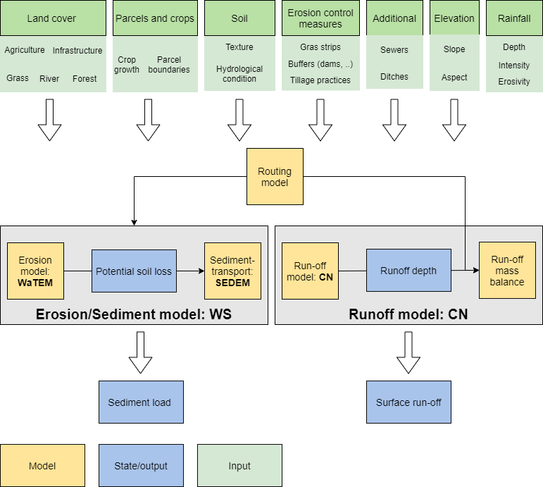

#####
CN-WS
#####

CN-WS is a model that can be used to
simulate soil erosion, sediment transport, water and sediment routing and
flow run-off in time and space. The package combines three existing submodels:

 - The Curve Number model (CN) for simulating flow run-off.
 - The WaTEM/SEDEM model (WS) for simulating erosion and over-land sediment
   transport.
 - The routing algorithm for simulating water and sediment routing over land.

CN-WS is developed to assess soil erosion on
agricultural fields, sediment transport through the landscape and sediment
delivery to watercourses and sewage systems. As the impact of soil erosion
mitigation measures is incorporated, the model can also be used to evaluate soil
erosion management measures and compare mitigation strategies.

This documentation page explains how CN-WS works and how the model can be used.
The official code for CN-WS can be found at https://github.com/cn-ws/cn-ws .

As stated above, the CN-WS model consists of three submodels. In the
following figure, the main input, models and outputs are shown. In general,
information on the land cover, agricultural parcels, crops, soil, erosion control
measures, elevation and rainfall are needed in order to use the model.
In addition, information on sewers and ditches can be used to refine the
model.

First, a routing table is created by the :ref:`routing algorithm <routing>` and is then used in
both the :ref:`WS <WS>` and :ref:`CN <CN>` submodels. However, the use of this routing table
varies for both the CN and WS model. In WS, the routing table is used to
compute slopes, upstream areas and the sediment mass balance, whereas in the
CN submodel, the routing is used to spatially distribute the runoff. It is
important to note that the distribution of the runoff in the CN submodel is
computed sequentially for every time step :math:`dt`. This makes CN an
event-based model, whereas WS is a year-based model. Note that it is
technically possible to use WS as an event-based model, yet a year-based
assessment is found to be more robust.

    Schematic diagram of the CN-WS package

The CN and WS model can also be used together, by using the
run-off to scale the yearly sediment load. This is explained :ref:`here
<CNWS>`.

.. note::
    The CN-WS package is still being optimized to make sure the CN, WS and
    routing algorithm can be run separately.

For who is this documentation?
==============================

This page aims to explain how the CN-WS model can be run for a given case
study, and which output can be analysed to study the specific case. In
addition, it aims to explain how a specific run for a case study can be set-up
(i.e. which input data are needed? in which format?). Finally, this page
is the reference for background information on model concepts, options, inputs
and outputs.

In order to run the CN-WS model, this set of minimal skills is required:

- Basic command line skills (know how to open your command line, and run an
  executable).
- Opening text files in a text editor.
- Opening raster data in QGIS, ArcGIS or your favorite GIS program.

.. note::

    The defined skills above allow you to run the CN-WS model with the input
    files listed in the package (for an example, see :ref:`here<tutorial>`).
    For generating your own input data for the model, for a self-defined
    case study, a good knowledge of GIS is required.

Download / Clone
================

The commandline interface of all releases can be found on
`the release page <https://github.com/cn-ws/cn-ws/releases>`_. The source code
can be cloned or downloaded via the main page. Note that you need to clone
the directory via HTTPS or SSH to access the testfiles of the molenbeek
(subdirectory ``testfiles``). The testfiles are not downloaded correctly when
the code is downloaded as a ZIP because they are stored via `Git Large File Storage
<https://git-lfs.github.com/>`_.
