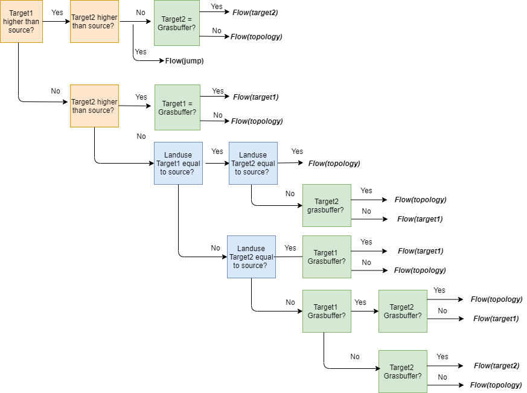

#######
Routing
#######

The flow and sediment routing is based on a multiple flow direction
algorithm implemented on a fixed grid. Specifically, the algorithm
makes use of the height profile and definition of land cover to define flow
from a source pixel to one or two target pixels. It is important to note
that the multi-flow routing algorithm developed for CN-WS is an algorithm
adjusted to the context of erosion and agriculture. This implies that the
routing should represent the average pattern of routing. This way, off-site
impacts (e.g. effect of erosion on an agricultural field on nearby urban
area) can be adequately be represented

The flow routing varies a function of the difference in height between
source and potential target pixels, and the land cover in the source and
targets. The land cover is defined in following table (see also :ref:`here
<prcmap>`). The codes listed in this table are used to define the routing in
CN-WS. In a first step, we make a distinction between the land cover of
(a) target(s) being equal to the class `river` (-1) (yes/no). Do note that in
this manual the non-river pixels are sometimes referred to as `land pixels`.

.. csv-table::
    :file: _static/csv/landcover_pixelid.csv
    :header-rows: 1

.. note::
    1. Routing flows from land to land pixels, land to river pixels, from river
    to river pixels, but not from river to land pixels!

    2. Routing can be defined in rivers, dams and ditches. Yet, this
    routing should be user-defined (see :ref:`here <riverrouting>`). If one
    does not have information to define this routing, then rivers and ditches
    can be implemented as sinks. See :ref:`here <riverrouting>` for the
    implementation in rivers, and :ref:`here <ditchmap>` and 
    :ref:`here <dammap>` for ditches and dams. It is important to note that
    ditches can also be modelled as end-points, see 
    :ref:`here <sewermapfile>`.
    

Situation 1: Target(s) is/are equal to `river`
==============================================
In this situation, two cases can be defined:

 - The source pixel is a land pixel: routing follows the direction of the
   river pixel (one target).

 - The source pixel is a river pixel: the direction of routing is defined by
   the river routing raster (see :ref:`here <routingmap>`), if the river
   routing option is set to one (see :ref:`here <riverrouting>`). The routing
   is defined as a uni-directional routing. If the river routing option is set
   to zero, then river routing is defined by the height profile in the river
   (routing stays within rivers).

Situation 2: Target(s) is/are not equal to `river`
==================================================

In a first step, the routing algorithm checks whether the flow direction is
steered by the steepest descent direction or the **tillage direction** (for the
format of the input of the tillage direction, see :ref:`here <tildirmap>`).
In this check, the angle of the **steepest descend** is compared with the
tillage direction to define the routing (see Takken et al. (2001)). At the end
of this step, the direction is mapped to the (inter-) cardinal directions.
These cardinal directions define the `target1` and `target2` pixels, and the
weight (:math:`\in[0,1], \sum \text{weight} = 1`) they receive from the
source pixel. This amount can be used to weight the sediment load per
pixel (WS), the direct run-off depth (CN) and upstream area (CN/WS) for each
target pixel. In next step, the flow directions and weights (cardinal space)
are adjusted according to elevation and land cover, as shown in the scheme
below:

In this figure, the `Flow(target1)` or `Flow(target2)` tag indicate that
routing will follow strictly the path of the first or second cardinal flow
direction. In these cases, the flow is uni-directional, instead of
two-directional. The `find_lower` tag indicates that the algorithm will
search for the lowest neighbouring pixel (single target). A `jump` indicates
the target is not a neighbouring pixel of the source: the routing jumps
to a single target further than its vicinity. Jumps are defined
within a window :math:`W`. This occurs when a source is located in a local
elevation minimum. An important note is that the routing will always jump to
the closest river in :math:`W` if a river pixel is present in the window
:math:`W`.

In the sketch, three features of the two targets and sources are accounted
for to define a rule-bank for the routing direction: the height, the land cover
code and presence of grass strips. First, it is checked whether
the targets are higher or lower than the source pixel. In case one of the
target pixels is higher, than the flow will be defined by the other target
based on the land cover code and presence of grass strips.

If both targets pixels are lower, than the land-use code of both targets is
checked. If both are diffrent to the land-use code of the source, than the
find_lower function is called. If one or both have a different land-use
code, than it is checked whether the pixels is (are) (a) grass strip(s): in
this case flow will always be defined by the grass strips.

The implementation of this rule-bank aims to satisfy following conditions:

 - The routing should generally follow the height profile.

 - Routing within one agricultural parcel will remain in the parcel until
   the lowest point of the parcel is reached. Thus, the routing will follow the
   height profile in the direction of parcel boundaries rather than the
   steepest descent.

 - Routing should target grass strips as a priority targets. An exception
   is defined if the two targets and source all have different land cover
   codes (with one target being a grass strip), and the target grass strip
   being higher than the other target: here the routing follows the
   direction of to the lowest pixel.

Buffers, ditches and routing dams
=================================

For buffers and ditches, exceptions for the routing are defined. In case one
of the targets is a buffer, the routing will flow to that one target. Within
the buffer, all routing is defined to a single target pixel: the pixel
defined with a non-zero buffer_id (see also :ref:`here<buffermap>`). This
pixel is considered as the buffer outlet. From this pixel, routing occurs
are described above.

For ditches and routing dams, the routing is defined by the user by
using routing map (see :ref:`here<routingmap>`). The routing within ditches and
routing dams is uni-directional.

.. note::
    Routing to ditches can also be defined as end-points. In this case, the
    ditch is considered to be a sewer/sink (see :ref:`here <sewermapfile>`).

References
==========
Takken, I., Govers, G., Jetten, V., Nachtergaele, J., Steegen, A., Poesen, J
., 2001. Effects of tillage on runoff and erosion patterns. Soil and Tillage
Research 61, 55–60. https://doi.org/10.1016/S0167-1987(01)00178-7
