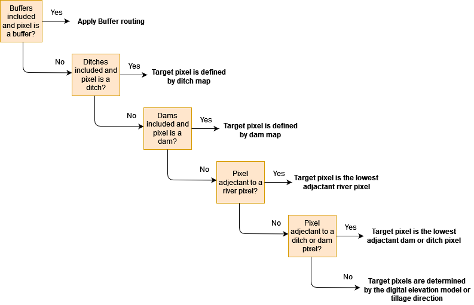
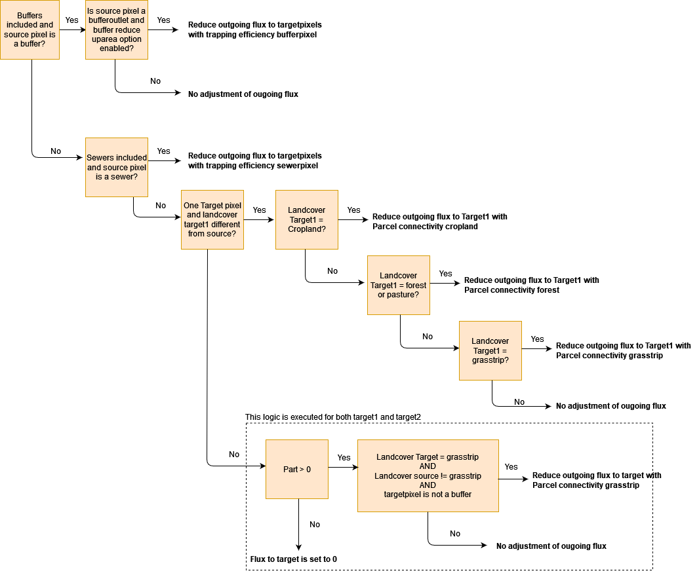

.. _routing:

#######
Routing
#######

The flow and sediment routing is based on a multiple flow direction
algorithm implemented on a fixed grid. Specifically, the algorithm
makes use of the height profile and class of land cover to define the flow
from a source pixel to one or two target pixel(s).

The flow routing varies as a function of the difference in height between
the source and **potential** target pixels, and the **land cover** class of
the source and targets. In addition, it varies as a function of presence of
conductive dams, conductive ditches and buffers (and forced routing, see
further). The land cover is defined in the following table
(see also :ref:`here <prcmap>`). The codes (pixel id) listed in this table are
used to define the routing in WaTEM/SEDEM. An important distinction is made between
the land cover of (a) target(s) being equal to the class `river` (-1) and not
being equal to the class `river` (non-river pixels). Do note that in this
manual the non-river pixels are sometimes referred to as `land pixels`.

.. csv-table::
    :file: _static/csv/landcover_pixelid.csv
    :header-rows: 1
    :align: center

===========
Definitions
===========

- Routing flows from land to land pixels, land to river pixels, river
  to river pixels, but not from river to land pixels!
- The **cardinal** direction is defined by the four main compass directions,
  north, east, south and west. **Cardinal pixels** are defined by the four
  neighbouring pixels of the source pixel in the cardinal directions.
- The **ordinal** (or intercardinal) direction is defined by the northeast,
  southeast, southwest and northwest direction. **Ordinal pixels** are defined
  by the four neighbouring pixels of the source pixel in the ordinal directions.
- **Routing maps** can be defined in rivers, conductive buffer dams and
  conductive ditches, see in the section :ref:`below <riverrouting_exp>`. In
  these routing maps specific routing directions can be defined,
- **Adjacent pixels** are defined by the **eight** neighbouring pixels of the
  source pixel.
- **One-target** routing is defined in the **cardinal** and
  **ordinal** directions (and any direction in between for
  :ref:`jumps <onetarget>`) while **two-target** routing is defined only by
  the **cardinal** direction.
- A **buffer** is not the same as a **conductive buffer dam** as
  **buffers** are defined as a
  :ref:`buffers with a buffer properties <bufferdata>`, whereas
  **conductive buffer dams** are defined as one-target
  :ref:`routing paths <routingmap>`. As such, it is
  up to the user to define a buffer measure as a **buffer** (with properties
  such as a trapping efficiency) (1) or a
  **conductive buffer dam** (with a routing raster) (2).

Flow scheme of the routing algorithm
====================================

In this section we will describe the routing algorithm in depth, with several
flow charts as an illustration.

The first step of the routing algorithm is to sort all pixels in the raster from
high to low, based on the :ref:`digital elevation model <dtmmap>`. In the
next step, the algorithm loops over all pixels, starting from the highest
pixel:

 - If the pixel is a **land pixel**, the default routing algorithm is used. If
   the user enables the :ref:`Forced Routing <forcerouting>`-option in the
   ini-file, the calculation of the routing by the default routing algorithm
   is altered on user-defined pixels. Thus, for these pixels, the
   user-defined routing will overrule the rulebank of the routing algorithm.
 - If the pixel is a **river pixel** and the river routing option is enabled
   (see :ref:`here <riverrouting>`), the algorithm will use the user-defined
   routing in the rivers. If the pixel is a river pixel and the river routing
   is not enabled, than no river routing is calculated.
 - If the landcover of a pixel has a value of 0, it is skipped and no routing
   is calculated for this pixel.

Routing in buffers, conductive ditches and conductive buffer dams
^^^^^^^^^^^^^^^^^^^^^^^^^^^^^^^^^^^^^^^^^^^^^^^^^^^^^^^^^^^^^^^^^

In the first part of the default routing algorithm, it is checked if the
routing of a considered pixel is determined by a **buffer**,
**conductive ditch** or **conductive buffer dam** or if the pixel is **adjacent
to** a **river**, **buffer**, **conductive ditch** or **conductive buffer dam**. This part of the
algorithm is illustrated in the figure below. There is only one target pixel
if a pixel is a conductive ditch, conductive buffer dam or adjacent
to a conductive ditch, conductive buffer dam or river. Note that the routing
in conductive ditches and conductive buffer dams always
routes to the lowest conductive ditch and conductive buffer dam pixel.
Routing to the lowest conductive ditches and conductive buffer dam pixel can
only be accepted from conductive ditches and conductive buffer dam pixels
to avoid looped routing.

    Flow-chart of the routing algorithm in WaTEM/SEDEM describing the first steps in
    the algorithm.

If the source pixel is a buffer pixel then two cases are defined:

    1. The considered pixel has a buffer_id. This is the outlet pixel of the
       buffer. The default routing algorithm is used in this pixel. Note that
       only routing from extension-id pixel can be accepted to avoid looped
       routing.

    2. The considered pixel has a buffer extension-id. In this case there is
       only one target pixel: the pixel within the buffer with the buffer_id
       (i.e. the outlet of the buffer).

We refer to the :ref:`section on buffers <includebuffers>` for a complete
description of how buffers are defined. For description on the definition of
conductive buffer dams and conductive ditches, we refer to the section on
:ref:`routing maps <riverrouting_exp>`.

In the second part of the default routing algorithm, two target routing is
defined (see :ref:`section two target routing <twotarget>`).

One- and two-target routing
^^^^^^^^^^^^^^^^^^^^^^^^^^^

Routing over land pixels can be defined as two- (cardinal directions)
or one-target (ordinal and cardinal directions) routing.

 - Two targets: routing is defined by one or two targets as a function of the
   direction, this only in the **cardinal direction**, thus only considering
   **four cardinal pixels**. Flows and sediment loads are distributed
   according to the angle between the direction (float number between 0 and
   360 degrees) and the cardinal axes
   (see :ref:`section two target routing <twotarget>`). This
   direction is determined by the digital elevation model (and if relevant the
   tillage direction).
 - One target: routing is defined by one routing vector, and can be in the
   **cardinal** and **ordinal direction**, thus **eight adjacent pixels**.
   One-target routing is based on a
   decision tree (see figure :ref:`section one-target routing <onetarget>`)
   using land cover and the digital elevation
   model. The starting point for one-target routing is the two-target routing.

Two-target routing is computed first based on the digital elevation model and
the tillage direction. This two-target routing can still be changed to
one-target routing based on the land cover of the targets (see
:ref:`section one-target routing <onetarget>`). Note that the digital
elevation information is still used in the one-target routing scheme
(in case of jumps).

.. _twotarget:

Two-target routing
^^^^^^^^^^^^^^^^^^

If the routing is not determined by a buffer, conductive ditch, conductive
buffer dam or a river, the routing algorithm checks whether the flow direction
vector **D** is steered by the steepest descent direction or the
**tillage direction** (for the format of the input of the tillage direction,
see :ref:`here <tildirmap>`). In this check, the angle of the
**steepest descent** is compared with the tillage direction to define the
routing (see Takken et al. (2001)). At the end of this step, the direction is
mapped to the cardinal directions. These cardinal directions define the
`target1` and `target2` pixels, and the weight
(:math:`\in[0,1], \sum \text{weight} = 1`) they receive from the source
pixel. This amount can be used to weigh the sediment load per pixel (WS), the
direct run-off depth (CN) and upstream area (CN/WS) for each target pixel (see
:ref:`next section <twotarget>`).

In the figure below it is shown how the two targets are determined by the
routing direction vector **D**. The routing direction (determined by the height
profile and - if included - the tillage direction) is first split in two
cardinal directions (**T1** and **T2**). Depending on the quadrant the
direction points to, index shifts are defined for the raster, with one pixel
in the x-direction (columns in rasters) and y-direction (rows in rasters)
(see also table below). The index shifts are used to define the two target
pixels. The amount of flow and sediment load that is routed to each of the two
targets is calculated by computing the angle between the cardinal direction of
the targets with the direction vector **D** (determined by height profile
and -if included- the tillage direction).

.. figure:: _static/png/cardinalflow.png
    :align: center

    Illustration of how two-target flow routing is determined. D = direction,
    T1 = Target1 (first clockwise target), T2 = Target2 (second clockwise
    target). I, II, III, IV = quadrant.

.. csv-table:: Index shifts (one unit) for the targets depending on the flow direction.
    :file: _static/csv/flowdirection.csv
    :header-rows: 1
    :align: center

.. _onetarget:

One-target routing
^^^^^^^^^^^^^^^^^^

One-target routing is determined by the digital elevation model and the land
cover of the two target pixels determined in the section above. The flow
directions and weights (cardinal space) are adjusted according to elevation
and land cover, as shown in the scheme below. Do note that in this procedure
two-target routing is adjusted to one-target routing. Cardinal directions
are maintained in this transformation, except for jump routing. By considering
jumps, a wider range of pixels are considered. As a consequence, the direction
is not solely defined by the cardinal and ordinal direction for jumps.

.. figure:: _static/png/sketch_flow_algorithm.png
    :align: center

    Flow-chart of the routing algorithm in WaTEM/SEDEM - adjusting routing according
    to elevation and land cover. This scheme adjust two-target routing to
    one-target routing. Note that the transformation of two-target to
    one-target routing will follow the cardinal directions, expect for the
    jumps. By considering jumps, a wider range of pixels are considered.
    As a consequence, the direction is not solely defined by the cardinal and
    ordinal direction for jumps.

In this figure, the `Flow(target1)` or `Flow(target2)` tag indicate that
routing will follow strictly the path of the first or second flow
direction. The `find_lower` tag indicates that the algorithm will
search for the lowest neighbouring pixel: this functionality is used to
indicate if a single target (cardinal and ordinal directions) is used instead of
two targets (cardinal direction). A `jump` indicates
the target is not a adjacent pixel of the source: the routing jumps
to a single target further than its eights adjacent pixels.  Jumps are
defined within a window :math:`W`. This occurs when a source is located in a
local elevation minimum. With increasing :math:`W` more potential targets are
considered, e.g. 16 for :math:`W` = 2, 25 for :math:`W` = 3, ...

An important note is that the routing will always
jump to the closest river in :math:`W` if a river pixel is present in the
window :math:`W`. This window :math:`W` can be defined in the ini-file with the
:ref:`kernel - variable <maxkernel>`.

In the flow chart, three features of the source pixel and the two target pixels
are accounted for to define a rule-bank for the routing direction: the elevation,
the land cover code and the presence of grass strips. First, the elevation of the target pixels
is examined in relation to the source pixel's elevation. In case one of the
target pixels is located at a higher elevation, the flow will be defined towards the other target
based on the land cover code and presence of grass strips.

If the elevation of both target pixels is lower, the land cover code of the targets is
checked. If they both have a different land cover code than that of the source, the
`find_lower`-function is called. Additionally, if one or both have a different land cover
code, it is checked whether the pixel(s) is/are (a) grass strip(s): in
this case the flow direction will always be defined by the grass strips.

The implementation of this rule-bank aims to satisfy following conditions:

 - The routing should generally follow the height profile.

 - Routing within one agricultural parcel will remain in the parcel until
   the lowest point of the parcel is reached. Thus, the routing will follow the
   height profile in the direction of parcel boundaries rather than the
   steepest descent.

 - Routing should target grass strips as a priority target. An exception
   is defined if the two target pixels and the source pixel all have different
   land cover codes (with one target pixel being a grass strip), and the target
   grass strip being higher than the other target: here the routing follows the
   direction of to the lowest pixel.

.. _upstreamarea:

Upstream area calculation
*************************

Once the routing is known, the upstream area for all pixels is calculated. A
distinction is made between the *influx* and the *upstream area* for a pixel.
The influx is defined as area of all pixels flowing into the considered
pixel, not considering the contribution of the considered pixel itself to the
area. The upstream area for a pixel is defined as the area of all pixels
flowing into the considered pixel, including the area of considered pixel:

.. math::
        A = {\sum_1^n{\text{influx}_i}} + a \cdot (1-PTEF)

with:
 - :math:`A`: the upstream area of the considered pixel (:math:`\text{m}^2`).
 - :math:`\text{influx}_i`: the area of all pixels flowing into the considered
   pixel :math:`i` (:math:`\text{m}^2`).
 - :math:`a`: the pixel size (:math:`\text{m}^2`).
 - :math:`PTEF`: the parcel trapping efficiency of a pixel.
 - :math:`n`: the number of source pixels. Note that only pixels are
   considered as source pixel in case they directly route to the target pixel.

The influx is defined as zero for all pixels that do not receive any flux from
upstream pixels. These pixels are the first pixels treated in the WaTEM/SEDEM routing
scheme. Their upstream area is equal to :math:`a \cdot (1-PTEF)`. The PTEF is
defined by the user for :ref:`cropland <parceltrapppingcrop>`,
:ref:`pasture <parceltrappingpasture>` and :ref:`forest <parceltrappingforest>`.

Once the upstream area of a pixel is known, the *outflux*, or distribution
of the upstream area to its target pixels, is calculated. By default this
outflux is equal to the upstream area of the source pixel itself. In
some special cases the outflux is reduced (for example in buffer outlets,
sewers or when the landcover of a target pixel is different from the source
pixel). The flow-chart below clarifies in which cases the reductions on the
upstream area are applied in the calculation of the outflux.

    Flow-chart of the distribution of the outflux of a pixel in WaTEM/SEDEM.
    Part is the fraction of the tabulated outflux. Note that
    the sum of Part to target1 (part1) and target2 (part2) is equal to 1.

When the outflux is known for a source pixel, this flux is added to the
influx of the target pixels by (note that part1+part2 = 1)

.. math::
        \text{influx}_{\text{target1},+} = \text{influx}_{\text{target1},-} +
        \text{outflux} \cdot \text{part1}

        \text{influx}_{\text{target2},+} = \text{influx}_{\text{target2},-} +
        \text{outflux} \cdot \text{part2}

with:

 - :math:`\text{influx}_{\text{target1}}`: the influx of the first target
   1 pixel. +: posterior, -: priori.
 - :math:`\text{influx}_{\text{target2}}`: the influx of the first target
   2 pixel. +: posterior, -: priori.
 - :math:`\text{outflux}`: the outflux of the source pixel.
 - :math:`\text{part1}`: the fraction of the routing from the source pixel to
   the first target pixel (-).
 - :math:`\text{part2}`: the fraction of the routing from the source pixel to
   the second target pixel (-).

Forced routing
**************
**Forced routing** is typically used to force a routing vector from a specific
source to a target pixel, in case of a local suboptimal routing pattern.
Forced routing is user-defined. The instructions for defining forced routing
are found :ref:`here <forcerouting>`.

.. _riverrouting_exp:

Routing maps
************
:ref:`Routing maps <routingmap>` maps  are used to define
routing in **rivers**, **conductive buffer dams** and **conductive ditches**.
We refer to separate sections for the definition of routing in
:ref:`rivers <riverrouting>`, :ref:`ditches <ditchmap>` and
:ref:`dams <dammap>`. The workflow on how to create these rasters is described
in the section on :ref:`routing maps <routingmap>`.

References
==========
Takken, I., Govers, G., Jetten, V., Nachtergaele, J., Steegen, A., Poesen, J
., 2001, Effects of tillage on runoff and erosion patterns. Soil and Tillage
Research 61, 55–60. https://doi.org/10.1016/S0167-1987(01)00178-7
